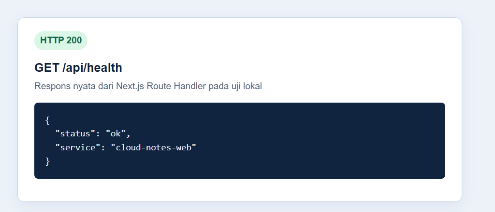
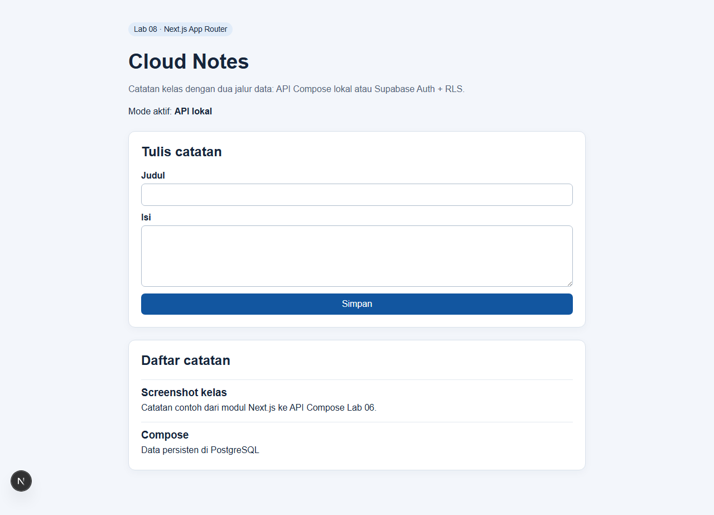
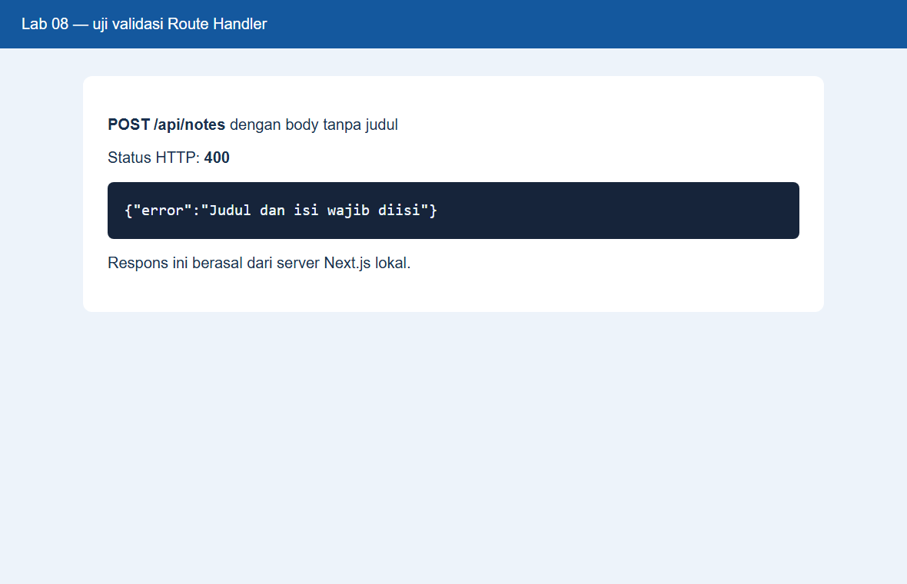
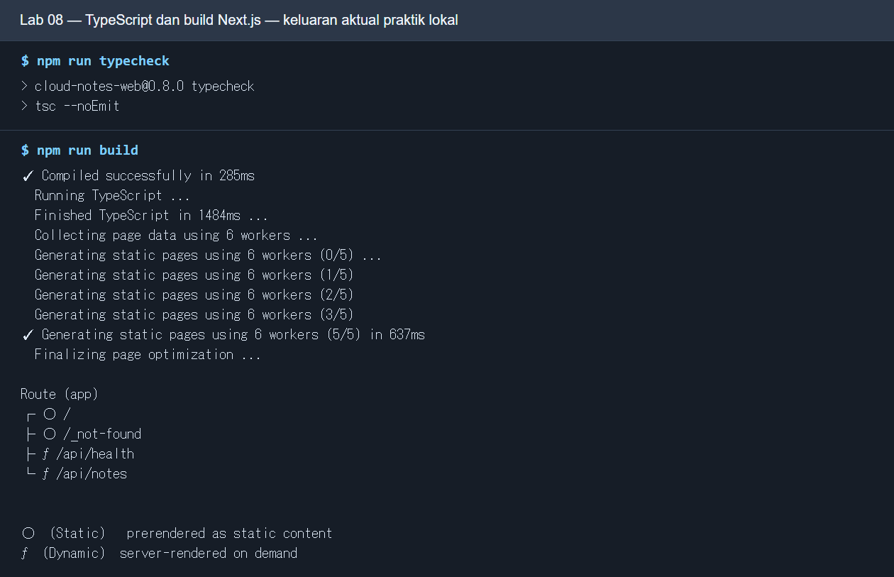
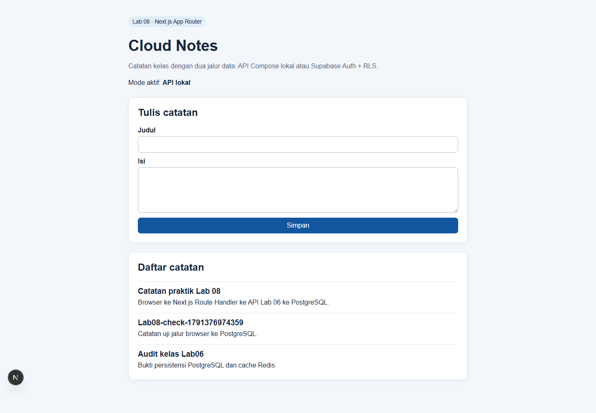
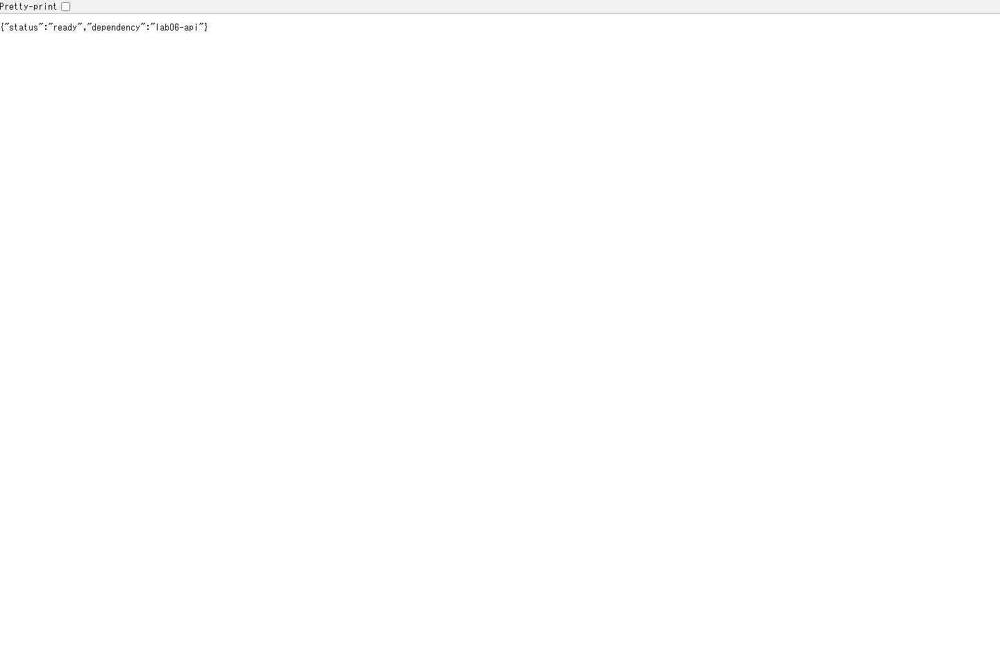
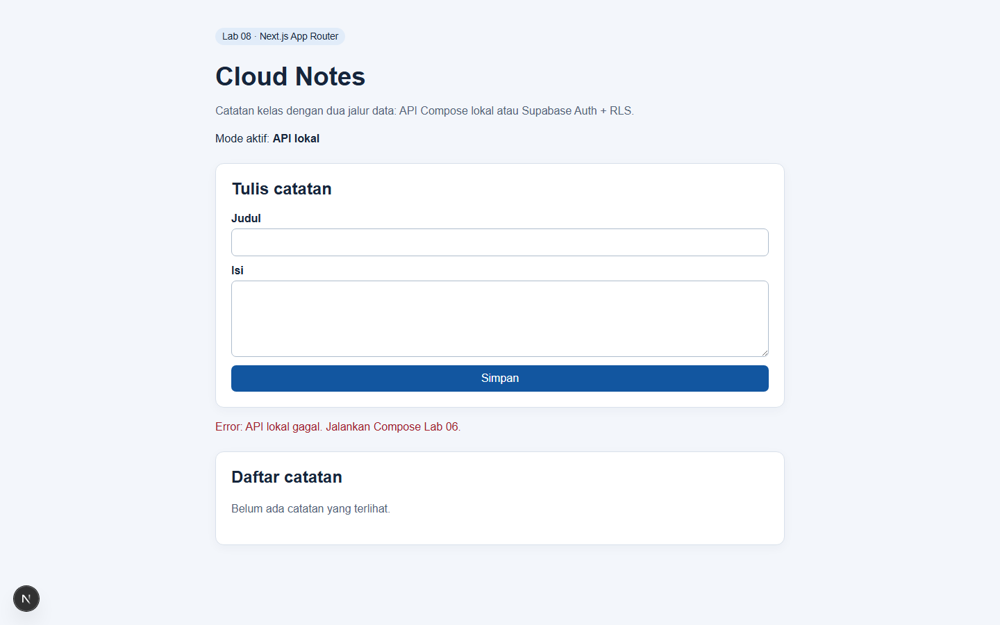
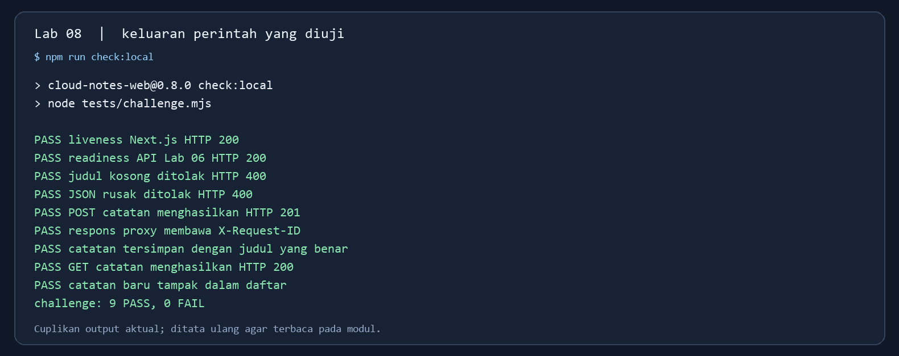

# Modul Mahasiswa Lab 08 — Cloud Notes dengan Next.js

**Sesi RPS:** 8 · **Mode utama:** lokal · **Hasil yang dikumpulkan:** source, laporan, screenshot hasil sendiri, dan commit Git.

## Tujuan dan konsep

Anda akan menjalankan frontend Next.js App Router untuk Cloud Notes. Halaman (`src/app/page.tsx`) memakai state dan form di browser; Route Handler (`src/app/api/notes/route.ts`) meneruskan GET/POST ke API Compose Lab 06 dari server Next.js. Mode Supabase memakai Auth dan RLS jika akun tersedia. Setelah lab, Anda harus dapat menjelaskan perbedaan Client Component, Route Handler server, API lokal, dan variabel yang boleh terlihat di browser.

Contoh Todo pada slide sesi 8 menjelaskan pola Next.js. Praktik yang dapat dijalankan dari repositori ini memakai Cloud Notes dan path `src/app/api/notes/route.ts`.

## Persiapan

- Node.js **minimal 20.9**, Docker dan Compose, serta [repo Lab 06](https://github.com/SeedFlora/meet6CloudService) yang sehat pada `http://127.0.0.1:8000/health`.
- Port 3000 belum dipakai proses lain. Hentikan server Lab 01/03 bila masih hidup.
- Dari root repo Lab 06, siapkan secret contoh lokal sesuai README dan jalankan `docker compose up --build -d`. Jangan commit file `.env` atau password nyata.

Dari root repo Lab 08, jalankan PowerShell:

```powershell
node --version
npm ci
Copy-Item .\.env.example .\.env.local
npm run dev
```

Pada Bash/WSL, gunakan `cp .env.example .env.local`. Jika `.env.local` sudah ada, periksa isinya sebelum menyalin ulang. Buka `http://localhost:3000` dan `http://localhost:3000/api/health`.

## Praktik bertahap

1. **Kenali komponen.** Buka `src/app/page.tsx` dan `src/app/api/notes/route.ts`. Tandai `'use client'`, event form, `fetch('/api/notes')`, serta `LOCAL_API_URL` yang hanya dibaca server. Catat aliran browser → Next Route Handler → API Lab 06 → PostgreSQL.
2. **Uji pembacaan.** Buka halaman dan cek label `Mode aktif: API lokal`. Refresh daftar. Dari terminal kedua, jalankan `Invoke-RestMethod http://localhost:3000/api/health` (PowerShell) atau `curl -fsS http://localhost:3000/api/health` (Bash). Harapkan HTTP 200.
3. **Tulis catatan.** Isi judul dan isi, klik **Simpan**, lalu pastikan catatan tampak pada daftar. Cocokkan dengan `http://127.0.0.1:8000/notes`. Amati terminal Next.js: log JSON `notes_proxy` memuat `requestId`, status, dan durasi tanpa isi catatan.
4. **Uji validasi.** Kirim body tanpa judul ke `/api/notes`; Route Handler seharusnya mengembalikan HTTP 400. Di PowerShell, jalankan perintah berikut dari terminal kedua:

```powershell
try { Invoke-RestMethod http://localhost:3000/api/notes -Method Post -ContentType application/json -Body (@{content='uji'} | ConvertTo-Json) } catch { [int]$_.Exception.Response.StatusCode }
```

Di Bash, gunakan `curl -i http://localhost:3000/api/notes -H 'Content-Type: application/json' -d '{"content":"uji"}'`. Jangan mengirim password/token dalam request contoh.
5. **Verifikasi build.** Hentikan `npm run dev` dengan `Ctrl+C`, kemudian jalankan `npm run typecheck` dan `npm run build`. Catat hasilnya. Saat build selesai, jalankan kembali `npm run dev` jika perlu screenshot.

### Tampilan pada setiap langkah

**Langkah 1 — Docker backend.** Pastikan container Lab 06 sehat sebelum menelusuri aliran browser → Next.js → API → PostgreSQL.


* **Langkah:** Jalankan `docker compose up --build -d` lalu `docker compose ps` dari root repo Lab 06. **Fungsi:** Memeriksa prasyarat API, PostgreSQL, dan Redis sebelum demo catatan. **Cara kerja:** Compose membangun/menjalankan service, jaringan, volume, dan healthcheck; API bergantung pada DB/cache. **Baca hasil:** Cari tiga service `healthy` dan port API 8000; jika masih `starting`, tunggu dan ulangi.

**Langkah 2 — endpoint health Next.js.** Kartu berikut menyusun ulang respons HTTP 200 dan JSON dari server lokal agar mudah dibaca; tampilan bawaan browser/terminal Anda dapat berbeda. Cek health API Lab 06 secara terpisah.



* **Langkah:** Jalankan `npm run dev` dari root repo Lab 08, lalu buka `http://localhost:3000/api/health`. **Fungsi:** Memeriksa Route Handler Next.js sebelum membuat catatan. **Cara kerja:** Next.js memproses GET pada server dan mengirim status/JSON; pemeriksaan API Lab 06 dilakukan terpisah. **Baca hasil:** Baca HTTP 200 dan JSON health; jangan menyimpulkan backend DB sehat hanya dari halaman ini.

**Langkah 3 — form dan catatan di web.** Setelah tombol **Simpan**, catatan terlihat pada daftar. Screenshot contoh ini berasal dari praktik lokal; kumpulkan hasil Anda sendiri.



* **Langkah:** Buka `http://localhost:3000`, isi judul/konten, lalu klik **Simpan**. **Fungsi:** Menguji frontend Cloud Notes dan daftar catatan. **Cara kerja:** Browser mengirim request ke Route Handler Next.js; server meneruskan ke API Lab 06 yang menyimpan ke PostgreSQL. **Baca hasil:** Cari mode API lokal, pesan sukses, dan catatan baru pada daftar setelah refresh.

**Langkah 4 — validasi.** Request tanpa judul menghasilkan HTTP 400 dari Route Handler. Kartu berikut menampilkan status dan body respons nyata dalam tata letak contoh, bukan antarmuka bawaan endpoint.



* **Langkah:** Kirim POST `/api/notes` tanpa judul melalui form atau `Invoke-RestMethod`. **Fungsi:** Memastikan input tidak valid ditolak sebelum disimpan. **Cara kerja:** Route Handler memvalidasi payload dan mengembalikan JSON error tanpa membuat catatan baru. **Baca hasil:** Baca HTTP 400 serta pesan validasi; daftar catatan tidak bertambah.

**Langkah 5 — pemeriksaan build.** TypeScript dan build Next.js lulus sebelum source dipush.



* **Langkah:** Jalankan `npm run typecheck` dan `npm run build` dari root repo Lab 08. **Fungsi:** Memeriksa tipe TypeScript dan kelayakan build sebelum push. **Cara kerja:** Compiler memeriksa tipe, lalu Next.js membuat bundle produksi. **Baca hasil:** Cari exit code 0 dan ringkasan build sukses; error tipe harus diselesaikan lebih dulu.

**Jalur cloud opsional:** ikuti [README Lab 08](README.md) untuk menjalankan `schema.sql` Lab 07 di Supabase, memasukkan URL dan *publishable key* pada `.env.local`, menguji dua akun, lalu mengimpor root repo Lab 08 ke Vercel dari repo Git. Jangan memakai `LOCAL_API_URL=localhost` pada deployment publik. `NEXT_PUBLIC_` hanya untuk nilai yang memang boleh dilihat browser; jangan menaruh service role/secret key di sana.

## Pertanyaan untuk laporan

1. Mengapa `page.tsx` memerlukan `'use client'`, tetapi Route Handler berjalan di server?
2. Apa yang terjadi jika API Lab 06 dimatikan? Catat status/respons dan bagian sistem yang masih hidup.
3. Mengapa URL dan publishable key Supabase boleh berada pada `NEXT_PUBLIC_`, sedangkan service role key tidak?
4. Untuk halaman daftar catatan yang berubah setiap pengguna, kapan SSR/SSG/ISR relevan? Jelaskan pilihan Anda.

## Bukti dan Git

Salin [`TEMPLATE_LAPORAN.md`](hasil/TEMPLATE_LAPORAN.md) menjadi `hasil/lab08.md` dari root repo. Sertakan screenshot **hasil Anda sendiri** (form + daftar), respons health, hasil typecheck/build, contoh log JSON yang aman, diagram aliran request, dan jawaban pertanyaan. Jika jalur cloud dipakai, tambahkan URL preview/produksi dan uji RLS dua akun.

Dari root repo Lab 08:

```bash
git status --short
git add .
git diff --cached --name-only
git diff --cached --check
git commit -m "lab08: frontend notes dan route handler"
git push
```

Simpan bukti milik Anda di `hasil/bukti/` bila ada; laporan tetap perlu memuat bukti hasil sendiri. Periksa daftar staged: `.env.local`, `node_modules`, `.next`, dan kunci rahasia tidak boleh masuk. Baca [panduan Git](PANDUAN_GIT.md) jika repo belum punya remote.

## Selesai dan kendala umum

Hentikan Next dengan `Ctrl+C`. Setelah tidak dipakai lab lain, dari root repo Lab 06 jalankan `docker compose --profile debug down`; volume tetap ada. Jika halaman menampilkan API lokal gagal, periksa health Lab 06 dan `LOCAL_API_URL`. Jika port 3000 terpakai, hentikan Lab 01/03 atau proses Next lama. Jika build gagal, cek versi Node dan kesalahan TypeScript yang ditunjuk terminal.

## Challenge kerja sehari-hari: catatan tidak tersimpan — kunci lengkap

Kasus: staf menekan **Simpan** tetapi daftar catatan tidak berubah. Tugas Anda menelusuri browser → Next.js → API Lab 06 → PostgreSQL, membedakan input salah dari layanan mati, lalu menunjukkan bukti pulih. Lab 06 berada di repo terpisah [SeedFlora/meet6CloudService](https://github.com/SeedFlora/meet6CloudService). Jalankan Lab 06 dan Lab 08 pada **komputer/Codespace yang sama**: `localhost` di dua Codespace berbeda tidak saling terhubung. Buka terminal pertama di clone Lab 06 untuk `docker compose up --build -d --wait`, lalu terminal kedua di root repo Lab 08 untuk `npm run dev`.

1. **Buktikan lapisan hidup.** Di terminal ketiga jalankan `curl -i http://localhost:3000/api/health`, `curl -i http://localhost:3000/api/ready`, dan `curl -i http://127.0.0.1:8000/health` (Bash). Di PowerShell gunakan `Invoke-WebRequest` untuk URL yang sama. `/api/health` memeriksa Next saja; `/api/ready` memanggil health API Lab 06 yang juga memeriksa PostgreSQL/Redis. Saat semua sehat, ketiganya HTTP 200. Bila browser membuka mode dev lokal, gunakan `http://localhost:3000`; endpoint dari terminal boleh memakai `127.0.0.1`.
2. **Bedakan validasi dari kegagalan backend.** PowerShell: `try { Invoke-RestMethod http://localhost:3000/api/notes -Method Post -ContentType application/json -Body '{"content":"uji"}' } catch { [int]$_.Exception.Response.StatusCode }`. Bash: `curl -i http://localhost:3000/api/notes -H 'Content-Type: application/json' -d '{"content":"uji"}'`. Kunci: HTTP **400** karena judul hilang; tidak ada catatan baru. JSON rusak juga HTTP 400. Ini terjadi sebelum request diteruskan ke API Lab 06.
3. **Simpan dan telusuri request.** Isi formulir browser dengan judul unik, misalnya `Audit catatan kelas`, lalu klik **Simpan**. Catatan muncul di daftar. Kunci terminal: `curl -i http://localhost:3000/api/notes` menghasilkan HTTP 200 dan judul itu; `curl -i -X POST http://localhost:3000/api/notes -H 'Content-Type: application/json' -d '{"title":"Audit API","content":"Jalur lengkap berhasil"}'` menghasilkan HTTP 201 serta header `X-Request-ID`. Cocokkan nilai header itu dengan `requestId` pada baris `notes_proxy` di terminal Next. Pada PowerShell, gunakan `Invoke-WebRequest`/`Invoke-RestMethod` dengan body JSON setara.
4. **Simulasikan outage secara terkontrol.** Di terminal Lab 06 jalankan `docker compose stop api` (biarkan DB/Redis hidup). `/api/health` Next tetap HTTP 200, `/api/ready` HTTP **503**, `/api/notes` HTTP **503**, dan halaman menampilkan pesan API lokal gagal. Terminal Next mencatat `notes_proxy_unavailable` tanpa isi catatan/password. Pulihkan dengan `docker compose start api`, tunggu `docker compose ps` menunjukkan `healthy`, lalu ulangi `/api/ready` dan daftar catatan; keduanya kembali berhasil. Hanya lakukan simulasi ini pada lingkungan praktik Anda sendiri.
5. **Verifikasi otomatis dan build.** Saat API sudah pulih jalankan `npm run check:local`: kunci **9 PASS, 0 FAIL**. Skrip membuat satu catatan uji bertanda `Lab08-check-...` agar membuktikan penulisan/pembacaan nyata. Hentikan `npm run dev` dengan `Ctrl+C`, lalu `npm run typecheck` dan `npm run build`; keduanya harus exit code 0. Setelah itu `npm run dev` lagi bila perlu screenshot.



*Perintah/tindakan:* `npm run dev`, buka `http://localhost:3000`, isi form dan klik **Simpan**. *Fungsi:* membuktikan aliran web sampai database. *Cara kerja:* browser POST ke Route Handler, server meneruskan ke API Lab 06, API menyimpan ke PostgreSQL, lalu web melakukan GET daftar. *Baca hasil:* judul baru terlihat di bagian Daftar catatan.



*Perintah/tindakan:* buka `http://localhost:3000/api/ready`. *Fungsi:* membedakan proses Next hidup dari dependensi Lab 06 siap. *Cara kerja:* Route Handler server meminta `/health` API Lab 06 dengan batas waktu tiga detik. *Baca hasil:* JSON `status: ready` dan HTTP 200 ketika API, PostgreSQL, serta Redis sehat; saat dependensi gagal, status 503.


*Perintah/tindakan:* `docker compose stop api` di repo Lab 06 lalu buka kembali `/api/ready`. *Fungsi:* membuktikan pemantauan mendeteksi dependensi tidak siap. *Cara kerja:* request server Next ke health API gagal, lalu Route Handler memberi HTTP 503. *Baca hasil:* `status: unavailable`; `/api/health` Next tetap 200. Pulihkan dengan `docker compose start api` dan tunggu status healthy.



*Perintah/tindakan:* refresh halaman Cloud Notes selama API mati. *Fungsi:* melihat gejala yang dialami pengguna. *Cara kerja:* browser meminta `/api/notes`, proxy mengembalikan 503, UI menampilkan pesan error. *Baca hasil:* form tetap terlihat, daftar tidak terisi sampai API pulih; catatan di PostgreSQL tidak terhapus.



*Perintah/tindakan:* `npm run check:local` setelah API pulih. *Fungsi:* memeriksa kembali liveness, readiness, validasi, simpan, dan baca. *Cara kerja:* skrip Node memanggil Route Handler dan memastikan catatan uji baru muncul di GET. *Baca hasil:* `9 PASS, 0 FAIL`; gambar menata ulang keluaran perintah aktual agar terbaca.

### Jawaban pertanyaan laporan

1. `page.tsx` memakai state, form, dan event di browser sehingga memerlukan `'use client'`. Route Handler menerima HTTP pada server Next; `LOCAL_API_URL` dibaca di server dan tidak perlu diekspos sebagai `NEXT_PUBLIC_`.
2. Jika API Lab 06 mati, halaman Next dan `/api/health` masih dapat merespons, tetapi `/api/ready` serta proxy `/api/notes` mengembalikan 503. Data lama di PostgreSQL tidak hilang; setelah API pulih, daftar muncul kembali.
3. `NEXT_PUBLIC_` dibundel ke browser. URL Supabase dan publishable key dirancang untuk client dengan RLS; service role/secret key memberi hak lebih luas dan harus tetap di server/secret store. Uji RLS dua akun pada jalur cloud bila tersedia.
4. Daftar catatan per pengguna tidak cocok dijadikan halaman statis bersama. Mode lokal ini memakai Client Component dan request tanpa cache. SSR bisa dipakai bila auth dan data diambil per request pada server; SSG/ISR hanya cocok untuk konten publik yang aman dibagikan dan tidak berubah per pengguna.

**Bukti yang dikumpulkan:** screenshot browser milik Anda sebelum/sesudah simpan, status 400 dan 503, hasil pulih 200, satu `X-Request-ID` yang cocok dengan log, 9 PASS, build sukses, dan jawaban alur request. Nilai contoh pada screenshot di atas berasal dari uji lokal dan dapat berbeda pada mesin Anda.


*Perintah/tindakan:* dari repo Lab 06 jalankan `docker compose up --build -d --wait`, kemudian buka Docker Desktop. *Fungsi:* memastikan backend tiga service siap sebelum Next. *Cara kerja:* Compose menjalankan API, PostgreSQL, dan Redis pada network internal; API memetakan host port 8000. *Baca hasil:* ketiganya hijau/healthy.
