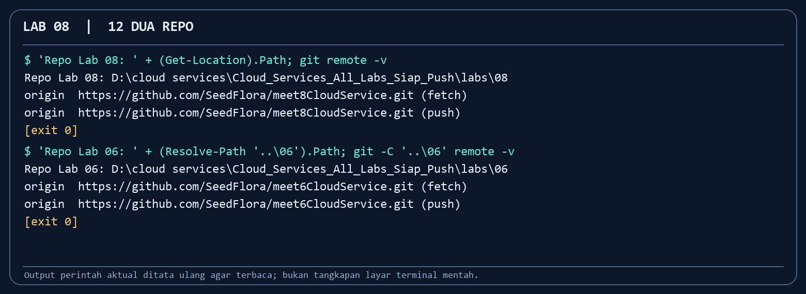
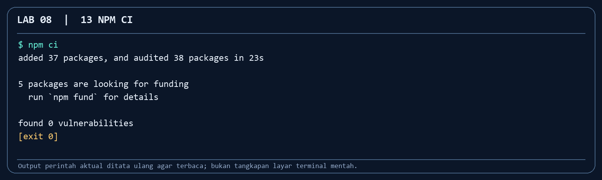
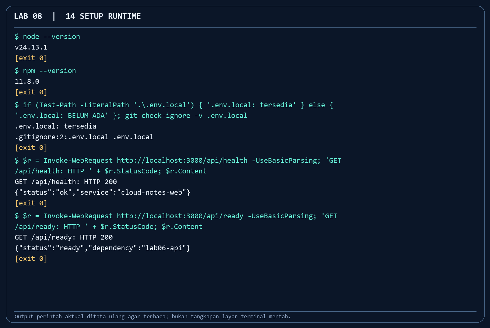
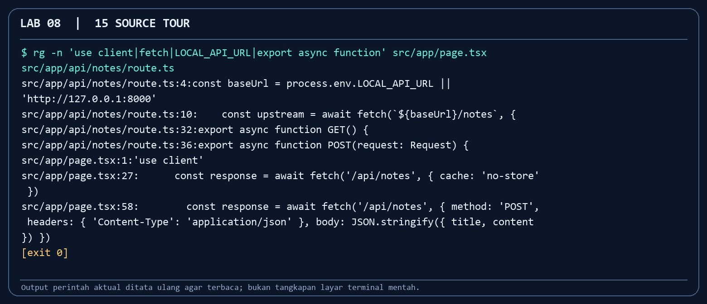
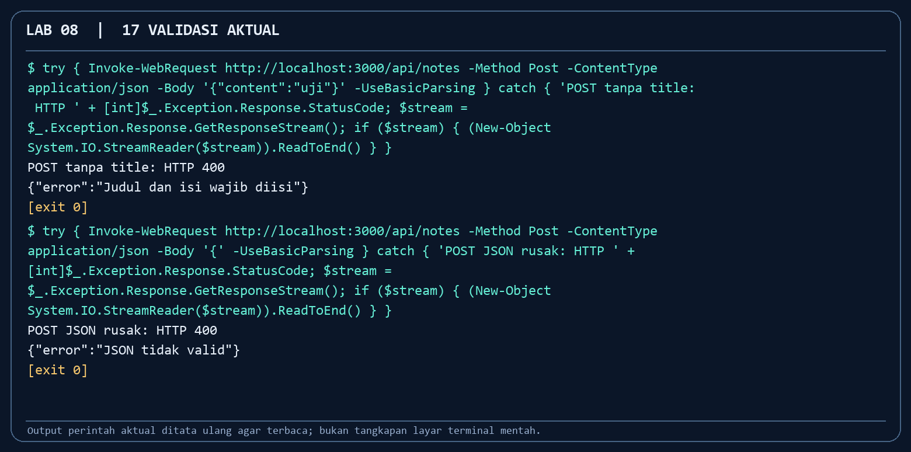
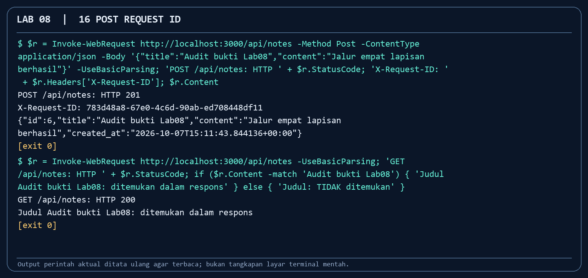
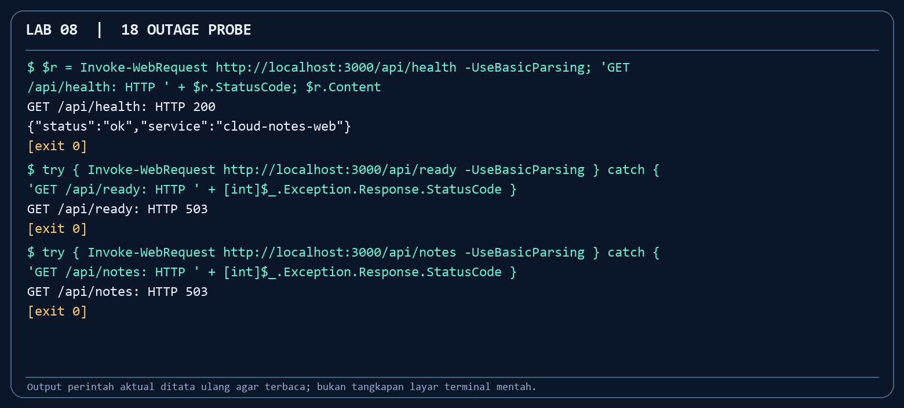
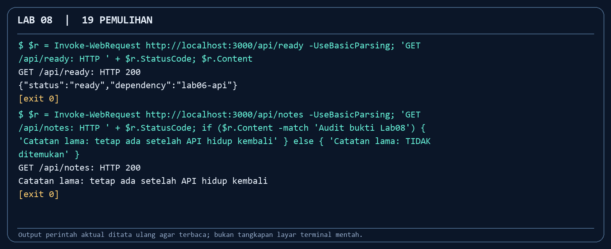
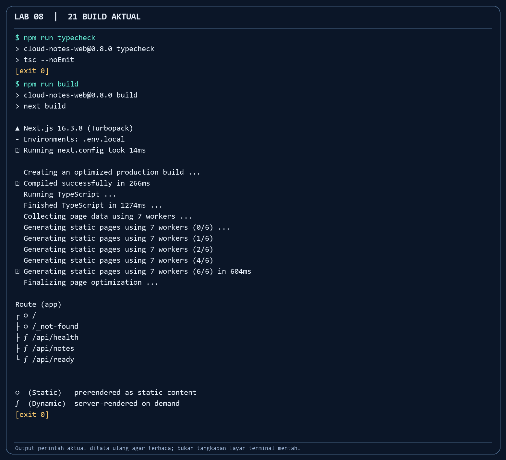
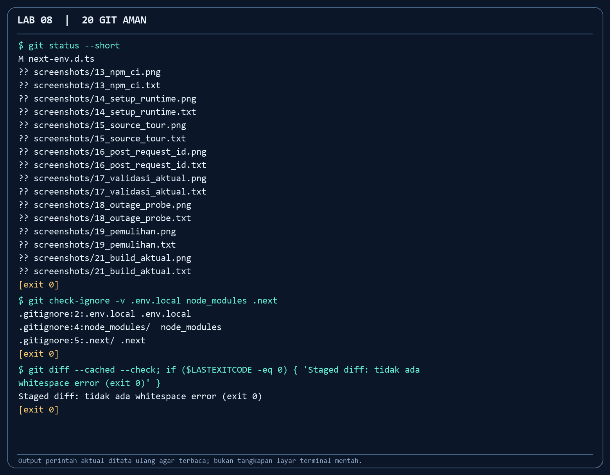

# Panduan Dosen Lab 08 — Cloud Notes Next.js

**Repo materi:** `SeedFlora/meet8CloudService` · **dependensi lokal:** [Lab 06](https://github.com/SeedFlora/meet6CloudService) pada host/Codespace yang sama · **durasi contoh:** 110 menit. Modul mahasiswa sudah memuat kunci challenge; tugas dosen adalah memandu observasi, memastikan setiap mahasiswa menjalankan kode sendiri, dan menguji alasan di balik status HTTP serta log.

## Tujuan dan kasus kerja

Mahasiswa menjelaskan batas browser/server pada Next.js App Router, menguji GET/POST Route Handler, menyimpan catatan lewat API Compose/PostgreSQL, dan membedakan liveness dari readiness. Kasus kerja: staf melaporkan catatan gagal disimpan. Mereka harus membedakan validasi 400, API mati 503, dan data yang sudah tersimpan.

Gambar Docker Desktop dan browser berasal dari antarmuka praktik aktual. Kartu terminal adalah render output perintah yang dijalankan; file `.txt` di sebelah PNG menyimpan output lengkap. Mahasiswa tetap mengambil screenshot sendiri untuk laporan. Jalur Supabase/Vercel opsional belum menghasilkan screenshot deploy pada paket karena memerlukan akun/proyek peserta.

| Checkpoint | Bukti visual di panduan | Kriteria pembacaan |
|---|---|---|
| Dua repo + instalasi | 12, 13, Docker Desktop | Lab 06/08 terpisah, satu host; `npm ci` exit 0; backend sehat. |
| Runtime dan source | 14, 15 | Next health/ready 200; `LOCAL_API_URL` hanya di server. |
| Simpan/baca | Browser 08, 16 | Catatan tampak; POST 201, GET 200, request ID cocok log. |
| Validasi | 17 | Dua bentuk input salah menghasilkan 400. |
| Outage/pemulihan | Browser gagal, 18, 19 | 200/503/503 saat API mati; ready/notes kembali 200. |
| Checker/build/Git | 08_challenge, 21, 20 | 9 PASS; typecheck/build exit 0; env/build diabaikan Git. |

## Prasyarat dan tata letak dua repo

1. Clone repo Lab 06 dan Lab 08 sebagai dua folder berdampingan. Di Codespaces, clone Lab 06 **ke dalam Codespace Lab 08** atau jalankan keduanya pada satu komputer. `localhost` pada dua Codespace yang terpisah menunjuk dua mesin berbeda.
2. Di root Lab 06 siapkan file `.env` dan secret sesuai README repo itu, lalu `docker compose up --build -d --wait`. Cek `docker compose ps` dan `http://127.0.0.1:8000/health`; API/DB/cache harus healthy. Jangan menampilkan isi secret di layar.
3. Di root Lab 08 pastikan Node >=20.9, jalankan `npm ci`, salin `.env.example` ke `.env.local`, dan pastikan `LOCAL_API_URL=http://127.0.0.1:8000`. Jalankan `npm run dev`, lalu buka **`http://localhost:3000`**. Browser dev pada `127.0.0.1:3000` dapat memicu proteksi origin HMR pada Next 16; URL `localhost` adalah jalur yang dipakai dalam praktik.
4. Buka tiga terminal: Compose Lab 06, Next.js Lab 08, dan perintah probe. Siapkan screenshot; contoh dalam modul berada di `screenshots/` repo ini.

*Command:* `git remote -v` di Lab 08 dan `git -C ..\\06 remote -v` untuk Lab 06 pada tata letak contoh. *Fungsi:* memastikan dua repo terpisah namun proses berjalan pada host yang sama. *Cara kerja:* Git membaca remote tanpa menghubungi server; Next nanti memakai `localhost:8000` untuk API. *Baca hasil:* remote `meet8CloudService` dan `meet6CloudService` berbeda. [Output lengkap](screenshots/12_dua_repo.txt).

*Command:* `npm ci` sebelum `npm run dev`. *Fungsi:* menyiapkan dependensi dari lockfile yang sama untuk seluruh kelas. *Cara kerja:* npm menyusun ulang `node_modules` dan mengaudit paket. *Baca hasil:* exit 0, 37 paket terpasang pada run ini. Jika Windows menampilkan `EPERM`/`ENOTEMPTY`, pastikan child proses Next dari repo ini sudah berhenti, lalu ulangi. Gambar merender [output aktual](screenshots/13_npm_ci.txt).

*Command:* `node --version`, `git check-ignore -v .env.local`, GET `/api/health`, GET `/api/ready`. *Fungsi:* memastikan prasyarat dan membedakan proses Next dari kesiapan backend. *Cara kerja:* ready memanggil API Lab 06, health hanya menguji Next. *Baca hasil:* Node memenuhi minimum, `.env.local` tidak terlacak, keduanya HTTP 200. [Output lengkap](screenshots/14_setup_runtime.txt).

*Command:* `rg -n 'use client|fetch|LOCAL_API_URL|export async function' src/app/page.tsx src/app/api/notes/route.ts`. *Fungsi:* menunjukkan lokasi kode untuk diagram aliran. *Cara kerja:* pencarian hanya membaca file source. *Baca hasil:* `page.tsx` memegang state/fetch browser; Route Handler memakai `LOCAL_API_URL` dan GET/POST server. [Output lengkap](screenshots/15_source_tour.txt).

## Alur kelas menit demi menit

| Menit | Dosen | Mahasiswa | Kriteria hasil |
|---|---|---|---|
| 0–15 | Jelaskan browser → Route Handler → API → DB/cache. | Gambar aliran dan tandai `page.tsx`, `route.ts`. | Variabel `LOCAL_API_URL` hanya pada server. |
| 15–30 | Jalankan Compose Lab 06 dan Next. | Ikuti dua terminal, cek status/ports. | API 8000 dan Next 3000 hidup. |
| 30–45 | Buka `/api/health`, `/api/ready`, lalu form. | Bandingkan liveness/readiness. | HTTP 200 dan JSON yang berbeda. |
| 45–60 | Kirim body tanpa judul serta JSON rusak. | Catat dua HTTP 400. | Tidak ada catatan baru. |
| 60–75 | Simpan catatan di browser dan via API. | Ambil screenshot, header request ID, log. | HTTP 201, GET 200, judul muncul. |
| 75–90 | Stop **hanya** API Lab 06; pulihkan. | Amati 200/503 dan `notes_proxy_unavailable`. | Data muncul kembali setelah start. |
| 90–100 | Jalankan `npm run check:local`. | Jelaskan 9 checks. | 9 PASS, 0 FAIL. |
| 100–110 | Hentikan dev, typecheck/build, Git. | Simpan laporan dan push repo sendiri. | Build exit 0, staged file aman. |

## Kunci dan perintah demo

**A. Liveness vs readiness.** PowerShell: `Invoke-WebRequest http://localhost:3000/api/health -UseBasicParsing` dan `Invoke-WebRequest http://localhost:3000/api/ready -UseBasicParsing`. Bash: `curl -i` untuk kedua URL. Kunci: health menunjukkan `status=ok` walaupun backend tidak ada; readiness baru 200 jika health API Lab 06 berhasil. Lab 06 `/health` juga memeriksa PostgreSQL dan Redis. Ini relevan untuk health probe deployment dan insiden produksi.

**B. Validasi.** `curl -i http://localhost:3000/api/notes -H 'Content-Type: application/json' -d '{"content":"uji"}'` menghasilkan **400** dari Next karena judul tidak ada. Body `{` juga 400 JSON tidak valid. Setelah keduanya, GET daftar tidak bertambah. UI memakai `required`, tetapi API tetap harus memvalidasi karena klien dapat mengirim request langsung.

*Command:* POST tanpa `title` lalu POST body `{` ke `/api/notes`. *Fungsi:* membedakan kesalahan input dari outage. *Cara kerja:* Route Handler menolak payload sebelum menghubungi Lab 06. *Baca hasil:* dua respons HTTP 400 dengan pesan berbeda; tidak ada catatan baru. [Output lengkap](screenshots/17_validasi_aktual.txt).

**C. Simpan dan korelasi.** `curl -i -X POST http://localhost:3000/api/notes -H 'Content-Type: application/json' -d '{"title":"Audit API","content":"Jalur lengkap berhasil"}'` menghasilkan **201** dan `X-Request-ID`. Baris log `notes_proxy` pada terminal Next membawa `requestId`, status, dan durasi. Cari ID yang sama; log sengaja tidak menyimpan isi catatan, password, atau token. GET `/api/notes` kembali **200** dan memuat judul. Form browser memakai Route Handler yang sama.

*Command:* POST JSON berisi judul/konten, lalu GET `/api/notes`. *Fungsi:* membuktikan tulis/baca melalui proxy server. *Cara kerja:* Next meneruskan POST ke Lab 06 dan memberi `X-Request-ID`. *Baca hasil:* 201, header `783d48a8-67e0-4c6d-90ab-ed708448df11`, lalu GET 200 dengan judul yang sama. Log Next pada run yang sama mencatat `event=notes_proxy`, `requestId` sama, `status=201`, `durationMs=22`, tanpa konten catatan. [Output lengkap](screenshots/16_post_request_id.txt).

**D. Insiden.** Dari Lab 06, `docker compose stop api`. `GET /api/health` Next tetap 200; `GET /api/ready` 503; `GET /api/notes` 503 dan log `notes_proxy_unavailable`. `docker compose start api`, tunggu healthy, ulangi probe; `/api/ready` 200 dan data sebelumnya tampak. Hindari `docker compose down -v` karena itu menghapus volume latihan. Jangan ganggu stack bersama bila kelompok lain sedang menjalankan pemeriksaan.

*Command:* `docker compose stop api` dari Lab 06, lalu GET `/api/health`, `/api/ready`, `/api/notes` dari Lab 08. *Fungsi:* melokalisasi kegagalan ke backend. *Cara kerja:* Next tetap hidup, tetapi dua Route Handler yang butuh upstream mengembalikan 503. *Baca hasil:* 200/503/503; terminal Next mencatat `notes_proxy_unavailable` tanpa isi catatan. [Output lengkap](screenshots/18_outage_probe.txt).

*Command:* `docker compose start api`, tunggu healthy, lalu GET ready dan notes. *Fungsi:* menutup insiden dengan bukti data tetap ada. *Cara kerja:* API kembali terhubung ke PostgreSQL dan Redis; Next proxy dapat memanggilnya. *Baca hasil:* ready 200, notes 200, judul lama ditemukan. [Output lengkap](screenshots/19_pemulihan.txt).

**E. Checker dan build.** `npm run check:local` melakukan sembilan check: liveness, readiness, dua validasi 400, POST 201, header ID, isi objek, GET 200, dan catatan ditemukan. Ia menyimpan satu catatan uji dengan judul `Lab08-check-...`. `npm run typecheck` dan `npm run build` harus exit code 0. Jika port 3000 bentrok, hentikan service lama; jangan mengganti port tanpa menyesuaikan URL checker (`LAB08_BASE_URL`).

*Command:* `npm run typecheck`, `npm run build` setelah menghentikan dev. *Fungsi:* gerbang source sebelum Git. *Cara kerja:* TypeScript memeriksa tipe, Next menyusun route produksi. *Baca hasil:* exit 0 pada kedua command dan `/api/ready` muncul dalam route build. [Output lengkap](screenshots/21_build_aktual.txt).

*Command/tindakan:* `npm run dev`, isi form, klik **Simpan**. *Fungsi:* menguji jalur empat lapisan. *Cara kerja:* browser POST ke Next, proxy ke Lab 06, API menulis ke PostgreSQL, frontend GET ulang. *Baca hasil:* judul baru berada di daftar.

*Command/tindakan:* buka `/api/ready`. *Fungsi:* melihat kesiapan dependensi. *Cara kerja:* server Next memanggil health API Lab 06 dengan timeout. *Baca hasil:* `status=ready`, HTTP 200; ketika API mati, HTTP 503.

*Command/tindakan:* `docker compose stop api` dari repo Lab 06, lalu buka `/api/ready`. *Fungsi:* demonstrasi kegagalan dependensi. *Cara kerja:* Next tetap hidup tetapi fetch health upstream gagal. *Baca hasil:* HTTP 503 dan `status=unavailable`; pulihkan API dan tunggu healthy sebelum lanjut.

*Command/tindakan:* refresh `/` selama API mati. *Fungsi:* menghubungkan sinyal teknis 503 dengan gejala pengguna. *Cara kerja:* Client Component fetch `/api/notes`, lalu menampilkan pesan error bila proxy gagal. *Baca hasil:* pesan API lokal gagal dan daftar tidak terisi; data tetap ada setelah pemulihan.

*Command:* `npm run check:local` setelah pemulihan. *Fungsi:* gerbang akhir jalur browser/server/backend. *Cara kerja:* sembilan request/validasi dibuat otomatis oleh `tests/challenge.mjs`. *Baca hasil:* 9 PASS, 0 FAIL; cuplikan output aktual ditata ulang agar mudah dibaca.

## Kunci diskusi mahasiswa

1. `'use client'` diperlukan untuk state/form/event pada `page.tsx`; Route Handler berjalan di server dan boleh membaca `LOCAL_API_URL` privat.
2. Mematikan API tidak mematikan Next, jadi halaman dan health Next tetap hidup; readiness serta catatan gagal 503. Data PostgreSQL tetap ada.
3. Nilai `NEXT_PUBLIC_` terlihat oleh browser. Supabase publishable key dipakai bersama RLS; service role/secret key harus hanya di server.
4. Daftar catatan pribadi harus dimuat per pengguna/request. SSG/ISR bersama berisiko menampilkan data yang salah; SSR per request atau Client Component dengan auth/RLS sesuai konteks.

## Rubrik, troubleshooting, dan keamanan

Nilai arsitektur/aliran (20%), request HTTP dan validasi (20%), simpan serta korelasi log (20%), insiden/pemulihan (20%), checker/build/Git (20%). Jika `npm run dev` menunjukkan halaman tetapi data kosong, periksa `/api/ready`, Lab 06 `/health`, dan `LOCAL_API_URL`. Jika browser UI tidak bereaksi di Next dev, pastikan URL **localhost** dan bukan 127.0.0.1 pada mesin uji ini. Jika checker gagal setelah API dipulihkan, tunggu `docker compose ps` healthy lalu ulangi. Periksa `git diff --cached --name-only` agar `.env.local`, `node_modules`, `.next`, dan secret tidak ikut. Mahasiswa push ke repo milik sendiri menggunakan [panduan Git](PANDUAN_GIT.md).

*Command:* `git status --short`, `git check-ignore -v .env.local node_modules .next`, `git diff --cached --check`. *Fungsi:* memeriksa bahan sebelum commit. *Cara kerja:* Git membandingkan working tree, aturan ignore, dan staged diff. *Baca hasil:* env, dependensi, dan build diabaikan. Dalam run contoh belum ada file staged; setelah mahasiswa `git add`, minta ulang pemeriksaan dan bukti push repo sendiri. [Output lengkap](screenshots/20_git_aman.txt).

## Bukti visual tambahan untuk demo

*Command:* `docker compose up --build -d --wait` dari repo Lab 06, lalu buka Docker Desktop. *Fungsi:* memeriksa prasyarat. *Cara kerja:* Compose menjalankan API, DB, dan Redis; API memetakan host 8000. *Baca hasil:* tiga service healthy.
